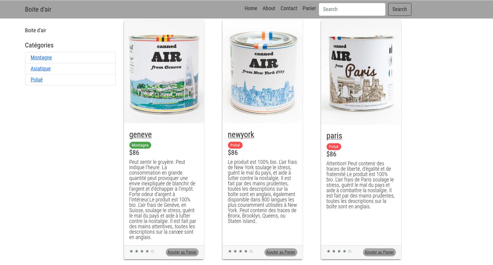
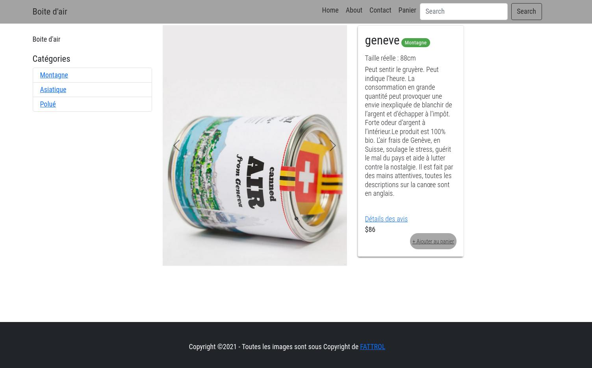
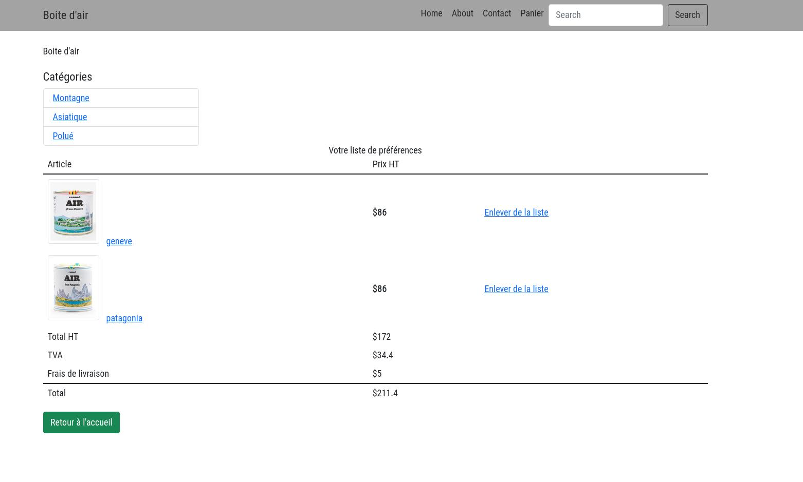

### Maquette de site E-commerce Boite d'air

Maquette d'e-commerce.


Découverte de Bootstrap et de EJS pour génerer du HTML dynamique avec du Javascript grâce a des templates.

L'application est developper avec un acces au données via un data Mapper et une base de données relationnel PostgresSQL

Seeding de postgresSQL disponible dans le dossier BD avec son MCD.


Disclaimer : tout le contenue utilisé photo texte et la propriété de FATTROL https://www.fattrol.com/







## Comment l'utiliser ? 

#### 1. Télécharger le repo sur votre machine

```bash
git clone <url du repo>
```

#### 2. Prérequis en local
-  Node.Js
-  Postgresql
-  Nodemon


#### 3. Installez les dépendances 

```bash
npm install 
```
  
-  Créer une base de données PostgreSQL   

- Créer votre fichier `.env` avec les paramètres en vous aidant de `.env.example`.
- Utiliser le fichier de seeding `create_db.sql` avec la commande `psql -U nomDeLutilisateur -d nomDeLaBase -f chemin/du/seeding.sql`.  

#### 4. Lancer l'application

- Exécuter `npm run start` pour lancer l'application
